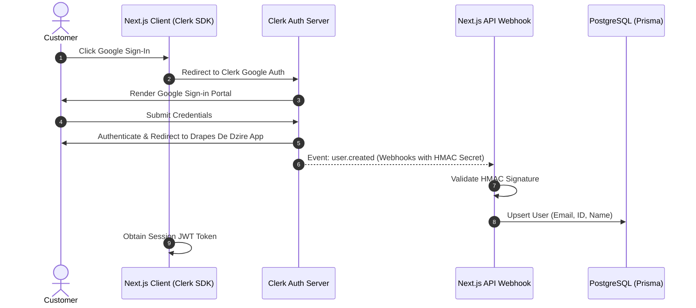
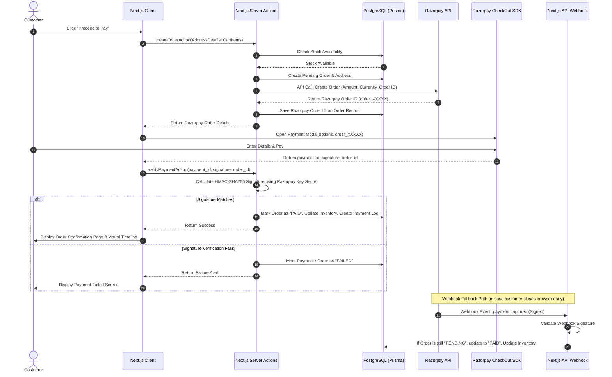
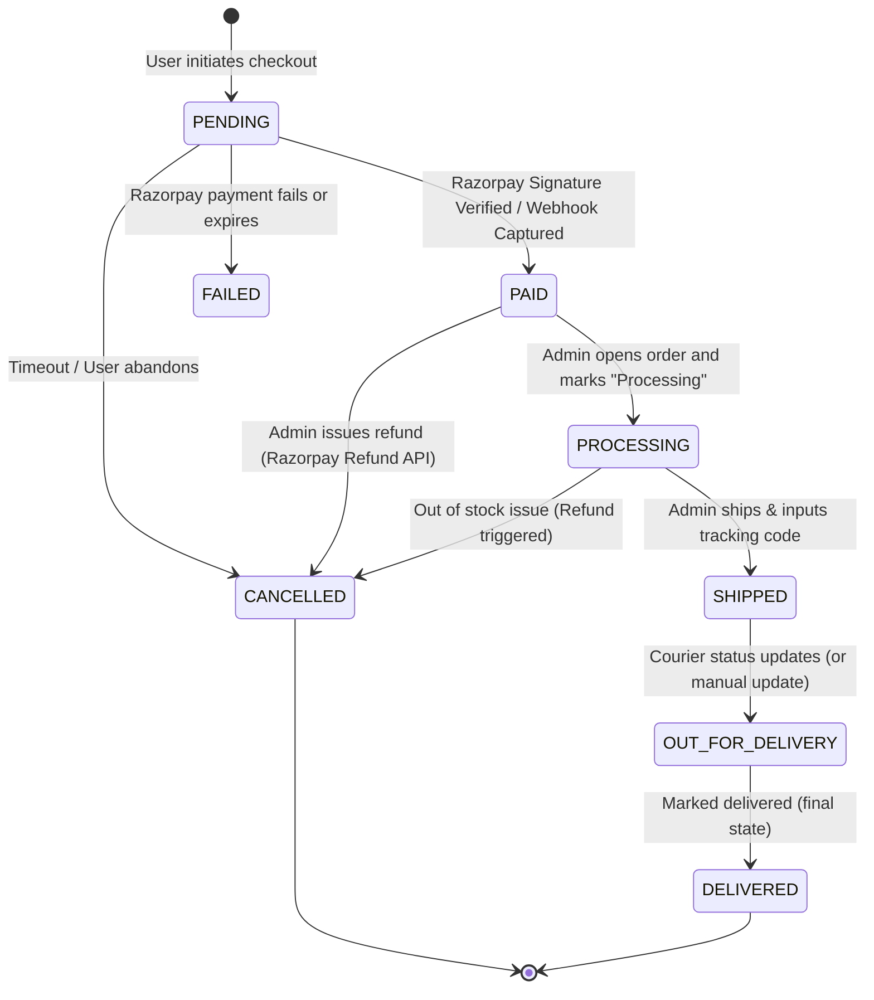

# System Architecture & Flows
**Project Drapes De Dzire** - Technical Architecture & Lifecycle Design

---

## 1. System Architecture Diagram

Below is the high-level architecture diagram representing Next.js 15, Clerk Auth, Postgres (via Prisma), Cloudinary, Resend, and Razorpay integrations.

```mermaid
graph TD
    %% Clients
    User[Customer Browser] <-->|HTTPS / HTML & JSON| CDN[Vercel CDN Edge]
    Admin[Admin Browser] <-->|HTTPS / HTML & JSON| CDN
    
    %% Application Layer
    CDN <-->|Routing & Render| NextServer[Next.js 15 App Router Server]
    
    subgraph Next.js 15 Environment (Vercel)
        NextServer -->|Server Components & SSR| Pages[React Pages / UI]
        NextServer -->|Server Actions| Actions[Next.js Server Actions]
        NextServer -->|API Routes| APIRoutes[Next.js API Routes]
    end

    %% Database & ORM
    Actions -->|Prisma Client| DB[(PostgreSQL Database)]
    APIRoutes -->|Prisma Client| DB

    %% External Systems & APIs
    Actions -->|Signed Upload Request| Cloudinary[Cloudinary Image Storage]
    Actions -->|Trigger Email| Resend[Resend Mail Service]
    Actions -->|Create Razorpay Order| Razorpay[Razorpay Payment API]
    
    %% Webhook Handlers
    Clerk[Clerk Auth Provider] -->|Webhook: User Events| APIRoutes
    RazorpayWebhook[Razorpay Gateways] -->|Webhook: Payment Success| APIRoutes

    %% Authentication Client Integration
    Pages <-->|JWT Tokens & Sign-In| Clerk SDK[Clerk Client SDK]
```

---

## 2. Authentication & User Sync Flow

The authentication utilizes **Clerk Auth** with Google OAuth 2.0. Users are persisted in the PostgreSQL database via a secure Webhook sync to ensure data integrity and query capability for orders, reviews, and wishlists.



---

## 3. Checkout & Razorpay Payment Verification Flow

Since security is a primary concern, the platform utilizes **Razorpay Hosted Checkout** with strict server-side signature verification.



---

## 4. Visual Order Timeline Lifecycle

The order state machine ensures that status values are locked in sequence and cannot skip invalid steps.



---

## 5. Complete Visitor & Customer Journey

The visual flowchart details the navigation steps from initial entry to successful order delivery:

```mermaid
graph TD
    Start([Landing on Homepage]) --> Browse[Browse Hero Banner & Featured Collections]
    Browse --> ClickProduct[Click on Saree Card]
    ClickProduct --> PDP[View Product Details Page: Multi-image, Care Instructions]
    
    PDP --> AddCart{Click "Add to Cart"}
    AddCart -->|Not Logged In| AuthRedirect[Redirect to Clerk Authentication]
    AuthRedirect --> GoogleAuth[Login via Google]
    GoogleAuth --> PDP
    
    AddCart -->|Logged In| Cart[Add Saree to Cart]
    Cart --> Checkout[Checkout Step 1: Address Input]
    Checkout --> OrderSummary[Checkout Step 2: Review Order Details]
    OrderSummary --> RazorpayModal[Checkout Step 3: Razorpay Payment Portal]
    
    RazorpayModal --> Confirm{Payment Success?}
    Confirm -->|Yes| OrderConfirmation[Order Confirmation Page: Details Summary]
    Confirm -->|No| Checkout
    
    OrderConfirmation --> OrderTracking[Order Tracking: Live Progress Timeline]
    OrderTracking --> End([Product Delivered])
```
