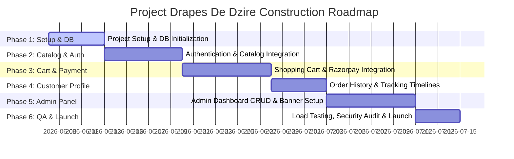

# Testing, Deployment, & Scalability Plan
**Project Drapes De Dzire** - Production Operations & Deployment Blueprint

---

## 1. Performance & SEO Strategy

### 1.1. Core Web Vitals Optimization
To guarantee a home page load time under 2 seconds, the architecture leverages:
*   **Next.js Server-Side Rendering (SSR):** Statically render the initial view of the homepage and collection pages. Hydration is minimized by keeping static elements as Server Components.
*   **Image Optimization (`next/image`):** Images are stored in Cloudinary, resized at the edge, converted to AVIF/WebP formats, and rendered with pre-configured width/height properties to eliminate layout shifts (CLS).
*   **Font Optimization:** Load Google Fonts (Bodoni/Cinzel and Inter) via `next/font` which downloads assets during build time, hosting them locally to prevent font-swap visual flashes.

### 1.2. SEO Architecture & Meta Strategy
*   **Dynamic Metadata Generation:** Implement Next.js 15 metadata generation for products and collections:
    ```typescript
    // src/app/products/[slug]/page.tsx
    export async function generateMetadata({ params }): Promise<Metadata> {
      const product = await getProduct(params.slug);
      return {
        title: `${product.name} - Buy Premium Sarees Online | Drapes De Dzire`,
        description: `Experience the elegant ${product.name}. Woven with premium ${product.fabric} fabric in ${product.colour}. Authenticity certified. Pan-India shipping.`,
        openGraph: {
          images: [{ url: product.images[0].imageUrl }],
        },
      };
    }
    ```
*   **Structured Data (JSON-LD):** Dynamically inject product schemas to display review stars, pricing, and stock status directly in Google Search results.
    ```json
    {
      "@context": "https://schema.org/",
      "@type": "Product",
      "name": "Crimson Kanchipuram Saree",
      "image": ["https://res.cloudinary.com/..."],
      "description": "Premium silk saree...",
      "offers": {
        "@type": "Offer",
        "priceCurrency": "INR",
        "price": "32500.00",
        "availability": "https://schema.org/InStock"
      }
    }
    ```
*   **Automated Sitemaps:** Generate dynamic sitemap files (`sitemap.xml`) indexing active collections and product page slugs.

---

## 2. Deployment Plan

The hosting infrastructure is partitioned for maximum availability and reliability:

```
               [ User Request ]
                      │
                      ▼
             ┌─────────────────┐
             │   Vercel Edge   │ (Frontend, Server Actions, API Routes)
             └────────┬────────┘
                      │
         ┌────────────┴────────────┐
         ▼                         ▼
┌─────────────────┐       ┌─────────────────┐
│ Neon PostgreSQL │       │   Cloudinary    │ (Product Images & Banners)
│  (Database)     │       └─────────────────┘
└─────────────────┘
```

*   **Frontend & Serverless Hosting:** **Vercel** - Auto-deployed on git push. Production branch: `main`. Staging branch: `staging`.
*   **Database Hosting:** **Neon (PostgreSQL)** - Serverless Postgres database with autoscaling capabilities and read-replicas.
*   **Asset CDN:** **Cloudinary** - Hosts high-resolution images, providing real-time transformations and low-latency asset delivery.
*   **Email Deliverability:** **Resend** - Sends transactional emails (Order Confirmation, Invoice, Shipping Alerts).

---

## 3. Development Roadmap (Phased Timeline)

The implementation is structured into 6 logical phases spanning 5 weeks, moving from environment infrastructure setup to full launch.



### 3.1. Detailed Phase breakdown

#### Phase 1: Project Setup & Database Foundations (Days 1–5)
*   **Objective:** Formulate repository structure, establish database schema relationships, and define design variables.
*   **Key Tasks:**
    *   Initialize Next.js 15 template using TypeScript, Tailwind CSS, and ShadCN UI.
    *   Set up Neon Serverless PostgreSQL DB instance; copy and migrate `schema.prisma`.
    *   Configure global CSS styling rules in `index.css` using the official brand color values (Ivory, Cream, Gold, Maroon, Rich Brown).
    *   Install developer tools (eslint, prettier, husky for pre-commit hooks).
*   **Deliverables:** Live blank project, deployed relational database schema, and configured Tailwind theme configs.

#### Phase 2: Authentication & Saree Catalog System (Days 6–12)
*   **Objective:** Implement secure authentication portals and create the frontend browsing interfaces.
*   **Key Tasks:**
    *   Integrate Clerk Auth SDK; set up Google Social Login (OAuth 2.0).
    *   Build Clerk webhook listener at `/api/webhooks/clerk` to auto-sync logged-in users with the local PostgreSQL database.
    *   Develop the Homepage containing responsive banners, Featured Collections, and reviews.
    *   Build the Product Listing Page (PLP) with advanced filtering sidebar controls (fabric, color, occasion, price range) and sorting features.
    *   Build the Product Details Page (PDP) showing high-res images, care instructions, and the interactive zoom-lens component.
    *   Incorporate Custom Page Skeletons into Next.js loading suspense configurations.
*   **Deliverables:** Social login portal, homepage, faceted search browser (PLP), details views (PDP), and page loaders.

#### Phase 3: Wishlist, Shopping Cart & Razorpay Checkout (Days 13–20)
*   **Objective:** Implement item reservation workflows, checkout procedures, and integration with the payment gateway.
*   **Key Tasks:**
    *   Configure Next.js 15 Server Actions gate constraints blocking cart/wishlist writes for unauthenticated guests.
    *   Build backend Server Actions handling Wishlist toggle additions/deletions.
    *   Develop local client cart state synchronized with database storage upon user login.
    *   Write the order placement server transaction logic, isolating inventory checks (`prisma.$transaction`) to prevent stock race conditions.
    *   Integrate the Razorpay Checkout overlay SDK; construct order generation `/api/checkout/create-order` and signature verification `/api/checkout/verify-payment` API routes.
    *   Build webhook listener `/api/webhooks/razorpay` to capture and process orphan successful payments.
*   **Deliverables:** Wishlist drawer, active shopping cart, secure Razorpay checkout gateway, and order database records.

#### Phase 4: Customer Profile & Order Tracking (Days 21–25)
*   **Objective:** Design profile fields, address management screens, and the visual tracking timeline interface.
*   **Key Tasks:**
    *   Develop user account address forms validated with Zod schemas.
    *   Design customer profile settings displaying order histories and verified review options.
    *   Build the interactive tracking timeline component, pulling order states (Placed, Paid, Processing, Shipped, Out for Delivery, Delivered) from the PostgreSQL DB.
*   **Deliverables:** Saved address manager, order tracking timeline screen, and personal profile panels.

#### Phase 5: Admin Control Panel & Content Management (Days 26–33)
*   **Objective:** Create administrative control routes, inventory management forms, and moderating tables.
*   **Key Tasks:**
    *   Build Next.js middleware protection rules restricting `/admin/*` views to Clerk sessions matching the environment email whitelist.
    *   Construct Admin dashboard analytics page listing orders, revenues, and pending actions.
    *   Create Product CRUD forms integrated with direct signed Cloudinary image upload requests (max 5MB file sizes).
    *   Build Home banner scheduler controls (HERO, FESTIVAL, and PROMOTIONAL banner toggle panels).
    *   Develop review moderation queue interfaces allowing admins to approve or flag and delete submitted customer reviews.
*   **Deliverables:** Admin control center dashboard, catalog update panel, homepage slider scheduler, and review moderating boards.

#### Phase 6: QA Auditing, Performance Tuning, & Launch (Days 34–37)
*   **Objective:** Perform final quality tests, search engine optimization metrics, and publish to production edge networks.
*   **Key Tasks:**
    *   Write Jest unit tests verifying pricing math, Zod schemas, and middleware auth controls.
    *   Develop E2E test scripts inside Playwright testing authentication gates and payment callback endpoints.
    *   Run Core Web Vitals checks ensuring mobile/desktop Lighthouse scores are above 90.
    *   Inject structured JSON-LD data onto catalog routes for SEO styling and launch the dynamic XML Sitemap generator.
    *   Deploy the production build onto Vercel CDN networks, configure environment files, and map the custom domain.
*   **Deliverables:** Inspected E2E test report, high-score SEO mapping, and live production e-commerce website.

---


## 4. Testing Strategy

The QA process checks safety and responsiveness across three core levels:

### 4.1. Unit & Integration Testing
*   **Engine:** Jest + React Testing Library + Prisma Mocking.
*   **Targets:**
    *   Verify Server Actions block unauthorized payloads (Zod parsing).
    *   Confirm pricing calculation functions sum up items and apply coupons correctly.
    *   Test database filters matching queries with multiple active facets (fabric + colour).

### 4.2. End-to-End (E2E) Testing
*   **Engine:** Playwright.
*   **Test Flows:**
    *   *Guest Flow:* Ensure Guest cannot click "Add to Cart" and is successfully redirected to Clerk authentication.
    *   *Checkout Flow:* Execute automated checkout tests utilizing Razorpay Sandbox credentials to assert order generation, validation, and redirection to the tracking page.
    *   *Admin Flow:* Verify that unauthorized accounts hitting `/admin` receive a `403 Forbidden` error.
    *   *Skeleton Loaders Flow:* Verify that navigating between pages displays layout-specific skeleton loader components during transition states before data renders.


### 4.3. Performance & Security Audits
*   **Lighthouse / WebVitals CI:** Assert that homepage desktop/mobile performance score is consistently above 90.
*   **OWASP Zap Scan:** Test for security bugs, XSS vulnerability, and authorization bypasses.

---

## 5. Future Scalability Plan

When transaction volume expands beyond the initial 100-saree catalog:
*   **Caching Layer (Upstash Redis):** Cache active product catalogs and homepage metadata configurations at the edge to reduce database calls.
*   **Database Optimization:**
    *   Add Neon Database Read-Replicas to redirect read queries (PLP, PDP) away from the primary database instance (which handles writes/orders).
    *   Perform regular index analysis on search/filter fields using pg_stat_statements.
*   **Search Engine (Typesense / Algolia):** Transition the search feature from relational SQL `LIKE` queries to a dedicated, typo-tolerant search engine like Typesense for sub-10ms search results.
*   **Inventory Alerts:** Implement automated Slack/Email alerts via Resend when a saree's inventory level falls below 2 items.
